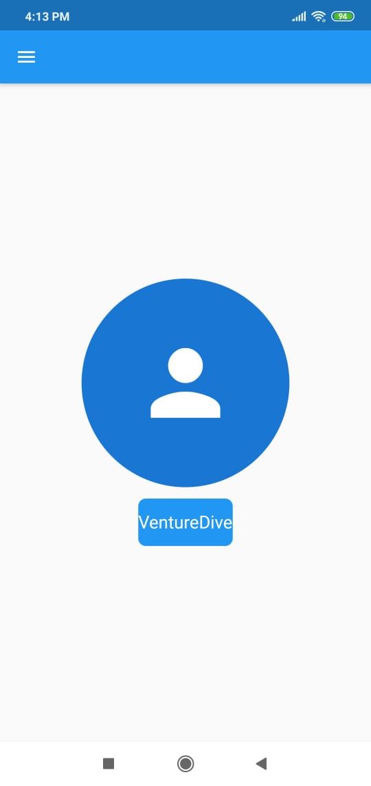

# VD_flutter_training_3

## Responsive User Interface

This project demonstrates different methods of handling responsive UI in flutter.
Some these methods are mentioned below:
1. Layout Builder
2. Media Query
3. Orientation Builder

# Screenshots

## Portrait Mode

## Landscape Mode


## A top layer example of how it is done. Explore the code for more understanding
```dart

Widget _buildLayoutWithMediaQuery() => _buildLayout(MediaQuery.of(context).size.width > 600);

Widget _buildLayoutWithLayoutBuilder() => LayoutBuilder(builder: (context, constraints) => _buildLayout(constraints.maxWidth > 600));

Widget _buildLayoutWithOrientationBuilder() => OrientationBuilder(builder: (context, orientation) => _buildLayout(orientation == Orientation.landscape));

```